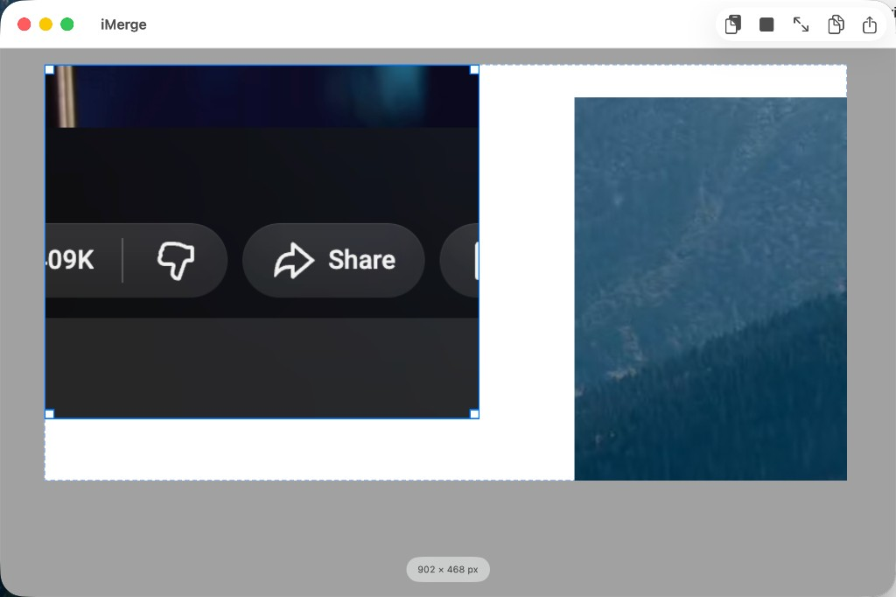

# iMerge

A simple Mac app for merging screenshots: paste images onto a canvas, drag them into place, sketch arrows or a cursor on top, then copy or export exactly what you see.



## Install (one command)

macOS 14+ with [Xcode](https://developer.apple.com/xcode/) (or the Xcode command line tools):

```bash
curl -fsSL https://raw.githubusercontent.com/OWNER/iMerge/main/install.sh | bash
```

That clones the repo, builds iMerge, puts `iMerge.app` in `~/Applications`, and opens it.

Already have a clone?

```bash
./install.sh
```

## Usage

- **⌘V** or drop files to add images
- Drag to move, drag a corner to resize (aspect ratio stays locked)
- **Space** + drag to pan, **⌘A** to select all, **⌫** to delete
- Sketch tools: arrow, cursor marker, freehand — then **Copy** or **Export**

## Requirements

- macOS 14+
- Xcode 15+
